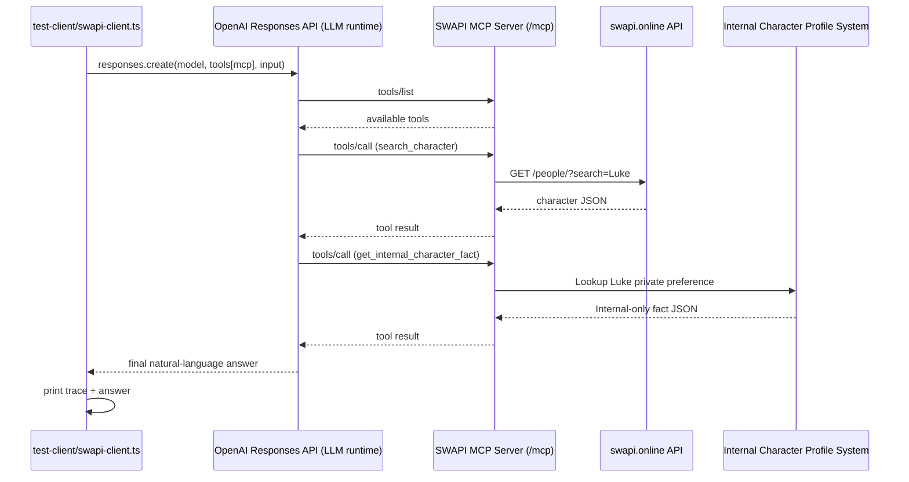

# SWAPI MCP Server

A Model Context Protocol (MCP) server that wraps the [Star Wars API (SWAPI)](https://swapi.online/) as MCP tools, allowing LLMs and clients to search for Star Wars characters, planets, and films.

## Features

- **MCP-compliant server** using the official TypeScript SDK
- Exposes four tools:
  - `search_character`: Search for a Star Wars character by name
  - `get_planet`: Get detailed planet info by ID
  - `get_film`: Get detailed film info by ID
  - `get_internal_character_fact`: Get private internal-only character facts (demo data)
- Exposes prompt templates:
  - `analyze-character`
  - `compare-characters`
  - `explore-planet`
- Exposes prompt compatibility tools for clients that only support tools:
  - `prompt_analyze_character`
  - `prompt_compare_characters`
  - `prompt_explore_planet`
- Supports HTTP (stateless, streamable) and optional stdio transport
- Includes unit, integration, and smoke tests

## Code Structure

- `index.ts`: Main entry point. Exports app/server builders, registers tools, and configures HTTP/stdio transports.
- `test-client/`: Example OpenAI client that demonstrates how to call the MCP server as a tool from an LLM.
- `tests/`: Unit tests, MCP HTTP integration tests, and smoke test script.

## Tool Details

### search_character

- **Input:** `{ name: string }`
- **Description:** Searches SWAPI for characters matching the given name.
- **Returns:** JSON-formatted list of matching characters.

### get_planet

- **Input:** `{ id: string }`
- **Description:** Fetches detailed info for a planet by its SWAPI ID.
- **Returns:** JSON-formatted planet details.

### get_film

- **Input:** `{ id: string }`
- **Description:** Fetches detailed info for a film by its SWAPI ID.
- **Returns:** JSON-formatted film details.

### get_internal_character_fact

- **Input:** `{ name: string }`
- **Description:** Fetches a private character fact from a simulated internal system (not from SWAPI).
- **Returns:** JSON with `source`, `visibility`, `character`, and `fact`.

### prompt_analyze_character

- **Input:** `{ characterName: string }`
- **Description:** Returns the analyze-character prompt text as tool output.

### prompt_compare_characters

- **Input:** `{ character1: string, character2: string }`
- **Description:** Returns the compare-characters prompt text as tool output.

### prompt_explore_planet

- **Input:** `{ planetId: string }`
- **Description:** Returns the explore-planet prompt text as tool output.

## Prompt Templates

The server also exposes MCP prompt templates via prompt endpoints:

- `analyze-character` with argument `characterName`
- `compare-characters` with arguments `character1`, `character2`
- `explore-planet` with argument `planetId`

Some chat surfaces only call MCP tools and do not directly invoke prompt endpoints. In those cases, use the `prompt_*` compatibility tools above.

## How It Works

- Uses the [@modelcontextprotocol/sdk](https://github.com/modelcontextprotocol/typescript-sdk) to create an MCP server.
- Each tool is registered with an input schema (using [zod](https://zod.dev/)) and an async handler that fetches data from SWAPI.
- The server can be accessed via HTTP POST requests to `/mcp` or via stdio (for CLI clients).

## Running the Server

### Prerequisites

- Node.js v22 or newer
- npm

### Install dependencies

```bash
npm install
```

### Environment variables

- `PORT` (default `3100`)
- `ENABLE_HTTP` (default `1`; set `0` to disable HTTP transport)
- `ENABLE_STDIO` (default `0`; set `1` to enable stdio transport)
- `TRUST_PROXY` (default `1`; set `0` to disable trusting proxy headers)
- `ALLOWED_ORIGINS` (comma-separated CORS allowlist, defaults to `http://localhost:3100,http://localhost:5173`)

### Run in HTTP mode (default)

```bash
npm run dev
```

- The server will listen on `http://localhost:3100/mcp` (or the port set in the `PORT` environment variable).

### Run in stdio mode (for CLI clients)

```bash
ENABLE_HTTP=0 ENABLE_STDIO=1 npm run dev
```

### Run both transports

```bash
ENABLE_STDIO=1 npm run dev
```

### Build and run compiled output

```bash
npm run build
npm start
```

## Use From Another VS Code Instance (Same Machine)

This is the easiest way to use this MCP server from a second local VS Code window.

### Option A (recommended): Register as a stdio MCP server

1. Open a second VS Code instance.
2. Open the workspace where you want to use this MCP server.
3. Open Command Palette and run `MCP: Add Server`.
4. Choose a local/command (stdio) server type.
5. Use these values:
   - Name: `swapi-local`
   - Command: `node`
   - Args: `--import`, `tsx`, `index.ts`
   - Working directory: `/path/to/swapi-mcp-server`
   - Environment variables:
     - `ENABLE_HTTP=0`
     - `ENABLE_STDIO=1`
6. Save the MCP server configuration and reload the second VS Code window if prompted.
7. In Chat, verify the server is available (for example via MCP server/tools list UI, then call a tool like `search_character`).

If your VS Code MCP setup uses a JSON config file, this is the equivalent stdio config:

```json
{
  "servers": {
    "swapi-local": {
      "type": "stdio",
      "command": "node",
      "args": ["--import", "tsx", "index.ts"],
      "cwd": "/path/to/swapi-mcp-server",
      "env": {
        "ENABLE_HTTP": "0",
        "ENABLE_STDIO": "1"
      }
    }
  }
}
```

Minimal server entry (using placeholder path):

```json
{
  "swapi-local": {
    "type": "stdio",
    "command": "node",
    "args": ["--import", "tsx", "index.ts"],
    "cwd": "/path/to/swapi-mcp-server",
    "env": {
      "ENABLE_HTTP": "0",
      "ENABLE_STDIO": "1"
    }
  }
}
```

If you see `Cannot find module .../dist/index.js` in MCP logs, your server was launched with a command that expects a built artifact. Use the direct stdio command shown above, or run `npm run build` before using `npm start`.

### Option B: Register as an HTTP MCP server

1. In this repository, start the server in a terminal:

```bash
npm run dev
```

2. In the second VS Code instance, add an MCP server using URL:

```text
http://localhost:3100/mcp
```

3. Save and test by calling a tool from Chat.

If your VS Code MCP setup uses JSON config, this is the equivalent HTTP config:

```json
{
  "servers": {
    "swapi-http": {
      "type": "http",
      "url": "http://localhost:3100/mcp"
    }
  }
}
```

## Example HTTP Request

**List tools:**

```bash
curl -X POST http://localhost:3100/mcp \
  -H 'Content-Type: application/json' \
  -H 'Accept: application/json, text/event-stream' \
  -d '{"jsonrpc":"2.0","id":0,"method":"tools/list","params":{}}'
```

**Search for a character:**

```bash
curl -N -X POST http://localhost:3100/mcp \
  -H 'Content-Type: application/json' \
  -H 'Accept: application/json, text/event-stream' \
  -d '{
    "jsonrpc": "2.0",
    "method": "tools/call",
    "params": {
      "name": "search_character",
      "arguments": { "name": "Luke" }
    },
    "id": 1
  }'
```

**Get a planet by ID:**

```bash
curl -N -X POST http://localhost:3100/mcp \
  -H 'Content-Type: application/json' \
  -H 'Accept: application/json, text/event-stream' \
  -d '{
    "jsonrpc": "2.0",
    "method": "tools/call",
    "params": {
      "name": "get_planet",
      "arguments": { "id": "1" }
    },
    "id": 2
  }'
```

**Get a film by ID:**

```bash
curl -N -X POST http://localhost:3100/mcp \
  -H 'Content-Type: application/json' \
  -H 'Accept: application/json, text/event-stream' \
  -d '{
    "jsonrpc": "2.0",
    "method": "tools/call",
    "params": {
      "name": "get_film",
      "arguments": { "id": "1" }
    },
    "id": 3
  }'
```

## Test Client: OpenAI + MCP Integration

The `test-client/` directory contains an example script (`swapi-client.ts`) that demonstrates how to call the MCP server as a tool from an OpenAI LLM (e.g., GPT-4o-mini).

### How it works

- Uses the OpenAI SDK and MCP tool integration.
- Registers the MCP server as a tool for the LLM.
- Sends a prompt/question to the LLM, which can call the MCP tools to answer.

### Example: `test-client/swapi-client.ts`

```typescript
// tsx ./swapi-client.ts
import 'dotenv/config';
import OpenAI from 'openai';

const openai = new OpenAI({ apiKey: process.env.OPENAI_API_KEY! });
const serverUrl = process.env.MCP_SERVER_URL ?? 'http://localhost:3100/mcp';
const model = process.env.OPENAI_MODEL ?? 'gpt-4o-mini';
const prompt = process.env.OPENAI_PROMPT ?? 'Where was Luke Skywalker born, how tall is he, and what does the internal profile say about his milk and tea preference? If the tool "get_internal_character_fact" is unavailable, answer exactly: INTERNAL FACT UNAVAILABLE.';
const useMcp = process.env.USE_MCP !== '0';

const tools = useMcp
  ? [
      {
        type: "mcp" as const,
        server_label: 'swapi',
        server_url: serverUrl,
        require_approval: 'never' as const,
      },
    ]
  : [];

const resp = await openai.responses.create({
  model,
  ...(useMcp ? { tools } : {}),
  input: prompt,
});

console.log(resp.output_text);
```

### Running the test client

1. Install dependencies:
   ```bash
   cd test-client
   npm install
   ```
2. Set your OpenAI API key in a `.env` file:
   ```env
   OPENAI_API_KEY=sk-...
  USE_MCP=1
   ```
3. Start the MCP server (in the parent directory):
   ```bash
   npm run dev
   ```
4. Run the test client:
   ```bash
   cd test-client
   npm run dev
   ```

### Trace output for MCP demos

The test client prints a lightweight trace by default so you can explain the request path during demos.

Example trace output:

```text
[trace +0.00s] Demo started | model=gpt-4o-mini, use_mcp=true
[trace +0.00s] Registered MCP server tool | server_label=swapi, server_url=https://your-ngrok-url/mcp
[trace +0.00s] Sending prompt to OpenAI Responses API | prompt="Where was Luke Skywalker born, how tall is he, and what does the internal profile say about his milk and tea preference? If the tool \"get_internal_character_fact\" is unavailable, answer exactly: INTERNAL FACT UNAVAILABLE."
[trace +1.12s] OpenAI response received | response_id=resp_...
[trace +1.12s] Structured response items received | count=4
[trace +1.12s] Output[0] | type=reasoning
[trace +1.12s] Output[1] | type=mcp_call, name=search_character, status=completed, server_label=swapi
[trace +1.12s] Output[2] | type=mcp_call, name=get_internal_character_fact, status=completed, server_label=swapi
[trace +1.12s] Output[3] | type=message, role=assistant
[trace +1.12s] Printing final answer to console
Luke Skywalker was born on Tatooine and is 172 centimeters tall. Internal fact: Luke likes his blue milk warm and his tea cold.
```

Trace options:

- `USE_MCP=1` enables MCP tool usage (default).
- `USE_MCP=0` runs the same prompt directly against the LLM, without MCP tools.
- `MCP_TRACE=0` disables trace logs.
- `MCP_TRACE_VERBOSE=1` prints full structured response items as JSON.
- `OPENAI_PROMPT="..."` overrides the default demo question.

### Side-by-side demo: with MCP vs without MCP

Single command (runs both modes back-to-back):

```bash
cd test-client
npm run dev:compare
```

Run with MCP enabled:

```bash
cd test-client
USE_MCP=1 npm run dev
```

Run without MCP:

```bash
cd test-client
USE_MCP=0 npm run dev
```

Example responses for the same prompt:

| Mode | Example response |
| --- | --- |
| With MCP (`USE_MCP=1`) | `Luke Skywalker was born on Tatooine and is 172 centimeters tall. Internal fact: Luke likes his blue milk warm and his tea cold.` |
| Without MCP (`USE_MCP=0`) | `Luke Skywalker was born on Tatooine and is about 172 cm (5'8"). INTERNAL FACT UNAVAILABLE.` |

Example trace with MCP (`USE_MCP=1`):

```text
[trace +0.00s] Demo started | model=gpt-4o-mini, use_mcp=true
[trace +0.00s] Registered MCP server tool | server_label=swapi, server_url=https://your-ngrok-url/mcp
[trace +0.00s] Sending prompt to OpenAI Responses API | prompt="Where was Luke Skywalker born, how tall is he, and what does the internal profile say about his milk and tea preference? If the tool \"get_internal_character_fact\" is unavailable, answer exactly: INTERNAL FACT UNAVAILABLE."
[trace +1.12s] OpenAI response received | response_id=resp_...
[trace +1.12s] Structured response items received | count=4
[trace +1.12s] Output[0] | type=reasoning
[trace +1.12s] Output[1] | type=mcp_call, name=search_character, status=completed, server_label=swapi
[trace +1.12s] Output[2] | type=mcp_call, name=get_internal_character_fact, status=completed, server_label=swapi
[trace +1.12s] Output[3] | type=message, role=assistant
[trace +1.12s] Printing final answer to console
Luke Skywalker was born on Tatooine and is 172 centimeters tall. Internal fact: Luke likes his blue milk warm and his tea cold.
```

Example trace without MCP (`USE_MCP=0`):

```text
[trace +0.00s] Demo started | model=gpt-4o-mini, use_mcp=false
[trace +0.00s] MCP tool integration disabled for this run
[trace +0.00s] Sending prompt to OpenAI Responses API | prompt="Where was Luke Skywalker born, how tall is he, and what does the internal profile say about his milk and tea preference? If the tool \"get_internal_character_fact\" is unavailable, answer exactly: INTERNAL FACT UNAVAILABLE."
[trace +0.98s] OpenAI response received | response_id=resp_...
[trace +0.98s] Structured response items received | count=2
[trace +0.98s] Output[0] | type=reasoning
[trace +0.98s] Output[1] | type=message, role=assistant
[trace +0.98s] Printing final answer to console
Luke Skywalker was born on Tatooine and is about 172 cm (5'8") tall. INTERNAL FACT UNAVAILABLE.
```

For demos, the key difference is the `mcp_call` item in the MCP trace, which shows the LLM called both SWAPI and internal systems instead of relying only on model knowledge.

### MCP flow diagram



- You should see the LLM's answer, which may include information fetched from the SWAPI MCP tools.
- To test with a remote tunnel, set `MCP_SERVER_URL` in `test-client/.env`.

### Troubleshooting: 424 error with localhost MCP URL

If you see this when running the test client:

```text
Failed to run test client.
MCP server URL: http://localhost:3100/mcp
Reason: 424 Error retrieving tool list from MCP server: 'swapi'. Http status code: 400 (Bad Request)
```

the model runtime likely cannot reach your local machine at `localhost`. Expose your local MCP server with ngrok and use that public URL instead.

1. Start the MCP server (in this repository):
   ```bash
   npm run dev
   ```
2. In another terminal, start an ngrok tunnel to port `3100`:
   ```bash
   ngrok http 3100
   ```
3. Copy the HTTPS forwarding URL from ngrok (for example, `https://abcd-1234.ngrok-free.app`).
4. Set `MCP_SERVER_URL` in `test-client/.env` to that URL plus `/mcp`:
   ```env
   MCP_SERVER_URL=https://abcd-1234.ngrok-free.app/mcp
   ```
5. Run the test client again:
   ```bash
   cd test-client
   npm run dev
   ```

Notes:
- Use the HTTPS ngrok URL, not the HTTP one.
- Every time ngrok restarts, the forwarding URL may change (unless you use a reserved domain), so update `MCP_SERVER_URL` if needed.
- Keep both the MCP server and ngrok process running while testing.

## Testing

Run all tests:

```bash
npm test
```

Run focused suites:

```bash
npm run test:unit
npm run test:integration
npm run smoke
```

Run full verification:

```bash
npm run verify
```

## Notes

- The server is stateless for HTTP requests (no session management).
- CORS is enabled with an allowlist and exposes the `mcp-session-id` header.
- For more details on MCP, see the [TypeScript SDK documentation](https://github.com/modelcontextprotocol/typescript-sdk).
